# A Practical Map of Modern AI: What All Those AI Terms Actually Mean

*Scalable, modular, agentic, federated, sovereign… A connected guide to 17 terms, and the different questions they answer.*

Imagine a digital assistant that helps you find information, understand documents, and get tasks done. You can speak to it, show it an image, or ask it to prepare a research brief.

Someone calls it generative AI. Someone else describes it as agentic, multimodal, or modular. Its developers talk about scalability, while the organization using it asks whether it is trustworthy.

Are these different products? Competing approaches? Generations of technology you are supposed to adopt one after another?

The confusion starts when we treat every phrase ending in “AI” as the same kind of label.

**These terms describe different, often overlapping dimensions of an AI system. They do not form a single ladder of progress.**

A car can be electric, modular, connected, and locally manufactured at the same time. Each description answers a different question. AI terminology works much the same way.

Some terms name established research fields. Others are broad engineering goals or policy ideas whose meanings vary by context. The map below is a practical guide, not an official taxonomy.

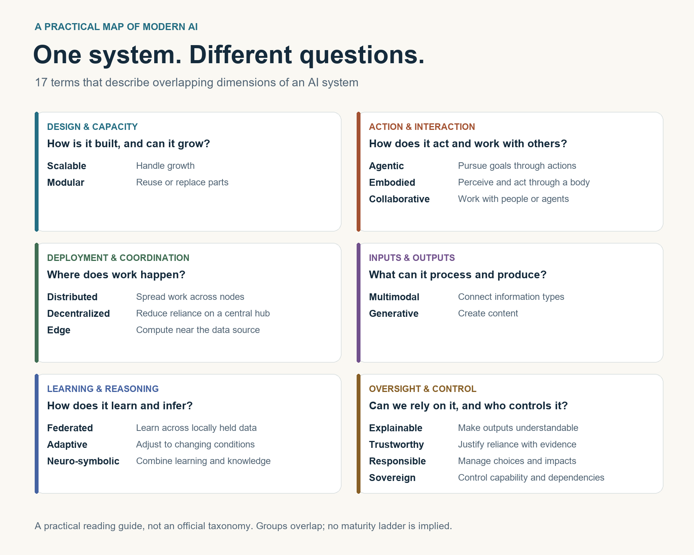

*One system, several dimensions. The groups overlap; their placement is a reading aid, not a boundary.*

The easiest way to navigate these terms is to ask what question each one answers. We will return to our imagined assistant as a familiar reference, then use examples from robotics, manufacturing, education, and research where they make a concept clearer. The definitions apply across industries; the assistant is simply a way to connect them. Linked research and projects provide concrete references.

## Start with three questions: Can it grow, change, and act?

### Scalable AI: Can it grow without becoming impractical?

**Scalable AI is about handling growth while keeping performance, reliability, and costs acceptable.** Depending on the context, the challenge might be training larger models, serving more requests, or operating across more devices and organizations.

Our assistant might work well for a small team. Can the service handle thousands of simultaneous users asking questions or translating documents without unacceptable delays or costs? That is a scalability question.

This is an engineering goal, not a particular model architecture. Bigger models and more hardware do not automatically produce a scalable service.

A concrete research example is [Ray, introduced by Moritz and colleagues at OSDI 2018](https://www.usenix.org/conference/osdi18/presentation/moritz), a framework for distributing computation in demanding AI applications.

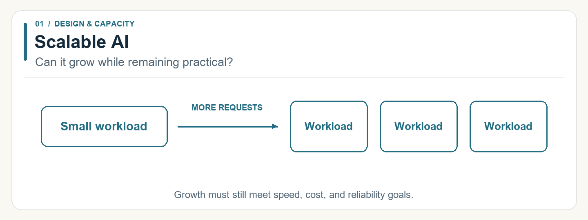

### Modular AI: Can its parts be reused or replaced?

**Modular AI organizes a system into components with defined responsibilities and interfaces.** A team can potentially improve one component or reuse it elsewhere without rebuilding everything. That still requires compatible inputs, outputs, and careful testing.

Our assistant could have separate components for speech recognition, information retrieval, and response generation. Improving the speech recognizer would not necessarily require replacing the other components. The same principle applies to recommendation services, industrial inspection systems, and other AI applications.

[TH Köln’s ModKI project](https://www.th-koeln.de/anlagen-energie-und-maschinensysteme/modki_115531.php) makes this idea concrete. Its documented research goals include interoperable, reusable AI applications for building automation and architectures that support operation alongside further training. The project describes prototype applications and planned validation; that is different from claiming a universally proven, plug-and-play solution.

Modularity may help a system scale, but the two are separate properties. An elegantly modular prototype can still become slow under heavy use.

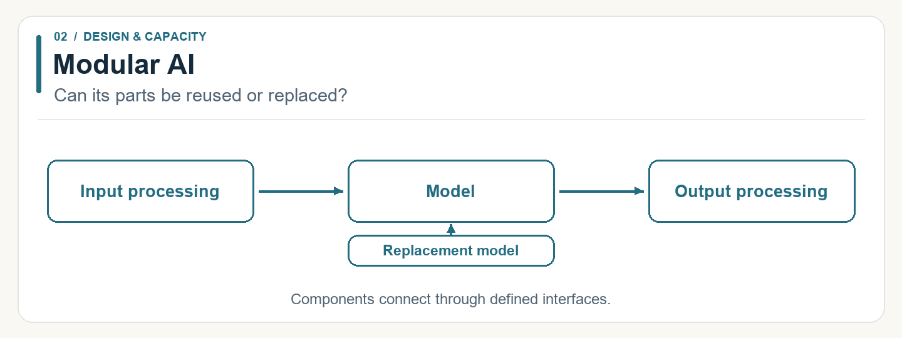

### Agentic AI: Can it pursue a goal through actions?

**Agentic AI involves pursuing an objective through a sequence of actions, using feedback to decide what to do next.** The available actions might include searching records, calling software tools, or changing an authorized setting.

Suppose we ask our assistant to prepare a research brief. It could choose searches, inspect sources, notice a missing piece of evidence, and search again before drafting. A coding agent could similarly edit code, run tests, and revise a failed fix. The key is the loop between deciding, acting, and checking the result.

The [ReAct paper by Yao and colleagues](https://arxiv.org/abs/2210.03629), presented at ICLR 2023, demonstrates a language-model approach that interleaves reasoning and actions. [Anthropic’s engineering guide](https://www.anthropic.com/engineering/building-effective-agents) offers another useful distinction: predefined workflows follow specified paths, while agents can dynamically direct their process and tool use.

The boundary is not perfectly standardized. A useful question is: **Which decisions can this system make, and which actions is it allowed to take?**

An agent can remain closely supervised. Agency does not require unrestricted autonomy, consciousness, or human-level intelligence.

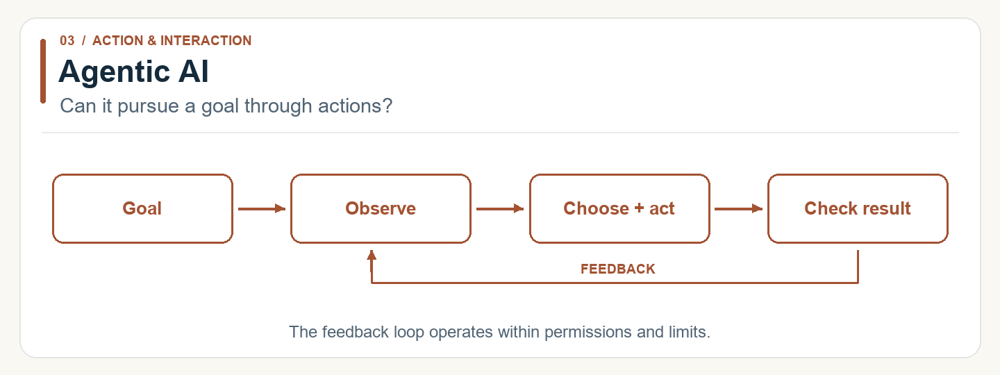

Already, our three starting terms fit together. Scalable describes growth. Modular describes structure. Agentic describes behavior.

## Where does the work happen, and who coordinates it?

Once we understand structure and behavior, we can ask where computation happens and how participants coordinate. These choices apply across many kinds of AI.

### Distributed AI: Is the work spread across multiple places?

**Distributed AI spreads computation or problem-solving across multiple machines or agents.** In infrastructure discussions, this often means dividing training or prediction work across computers. In multi-agent research, it can mean multiple agents contributing to a problem.

The service behind our assistant could assign requests to different servers. A research team could also divide model-training work across several computers. Ray is one concrete implementation of distributed computing for AI. Distribution can support scalability, but communication and coordination also introduce overhead. [Ray research paper](https://www.usenix.org/conference/osdi18/presentation/moritz).

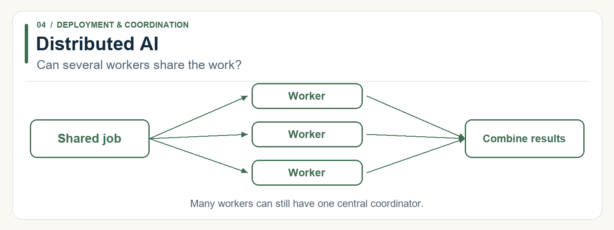

### Decentralized AI: Does coordination depend on one central authority?

Our assistant could rely on hundreds of machines while one central service controls them all. Distribution alone tells us little about who is in charge.

**Decentralized AI reduces reliance on a single coordinating point.** In decentralized learning, participants may exchange updates with their peers instead of sending everything through one central coordinator. [Lian and colleagues’ NeurIPS 2017 paper](https://proceedings.neurips.cc/paper/2017/hash/f75526659f31040afeb61cb7133e4e6d-Abstract.html) studies this kind of decentralized optimization.

In broader discussions, the label can also concern ownership or governance. Ask what exactly is decentralized: computation, coordination, data, or decision-making authority. A peer-to-peer algorithm does not establish decentralized ownership, and blockchain is not required.

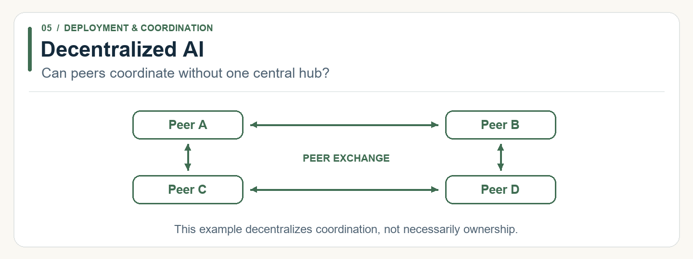

### Edge AI: Is computation close to where the data comes from?

**Edge AI runs AI computation on a device or nearby infrastructure**, such as a phone, camera, industrial controller, or local gateway.

Our assistant could recognize a spoken command on a phone. In another setting, a factory camera could inspect a part near the production line. Processing near the source can reduce network delays and data transfers. Actual benefits depend on the hardware and design, and some functions may still need a cloud connection.

[Zhou and colleagues’ survey of edge intelligence](https://arxiv.org/abs/1905.10083) examines how AI training and inference can move toward the network edge.

Edge describes location. It does not, by itself, guarantee privacy, offline operation, or local ownership.

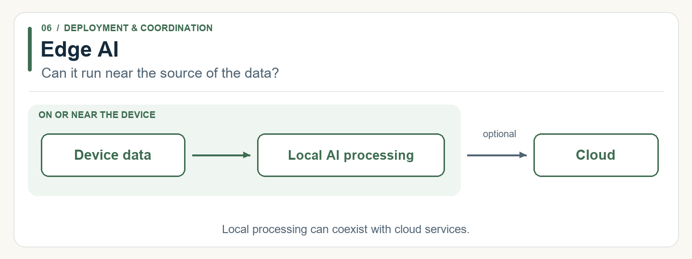

### Federated AI: Can participants learn together while keeping training data local?

**Federated AI usually refers to federated learning: participants train collaboratively while retaining their training data locally.** A common design sends a model to participants, combines their locally computed updates, and repeats the process. [McMahan and colleagues’ 2017 paper](https://proceedings.mlr.press/v54/mcmahan17a.html) established an influential version of this approach.

Imagine improving a typing-prediction feature in our assistant. Phones could train on locally stored text without uploading the raw messages into one training database. Participants can also be whole organizations, each holding its own dataset.

Notice the distinctions. Edge AI concerns where computation happens. Federated learning concerns how training is organized. Federated learning can use a central coordinator, so it is not necessarily decentralized in that sense.

Keeping raw data local also does not guarantee privacy: model updates can reveal information. Additional protections may be needed, as discussed in [Kairouz and colleagues’ research review](https://arxiv.org/abs/1912.04977).

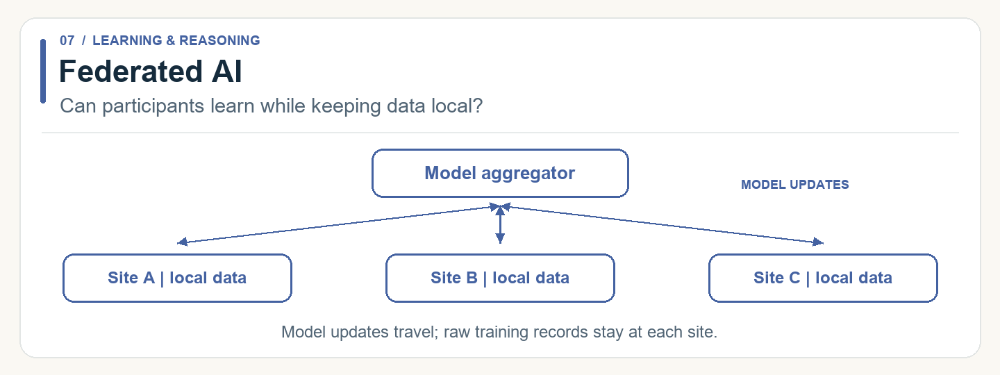

## What information can it work with, and what can it produce?

Location and coordination tell us little about the system’s actual capabilities. For that, we need another pair of terms.

### Multimodal AI: Can it connect different kinds of information?

**Multimodal AI processes and relates multiple forms of information**, such as text, images, sound, and sensor measurements.

Show our assistant a photograph of a bicycle and ask aloud, “Which part looks damaged?” It needs to connect visual information with language. The useful part is relating evidence across formats.

[Baltrušaitis, Ahuja, and Morency’s survey](https://arxiv.org/abs/1705.09406) maps the challenges of representing, aligning, and combining these different modalities.

A system may accept several input types while producing only one output type. “Multimodal” does not mean it can understand every kind of information equally well.

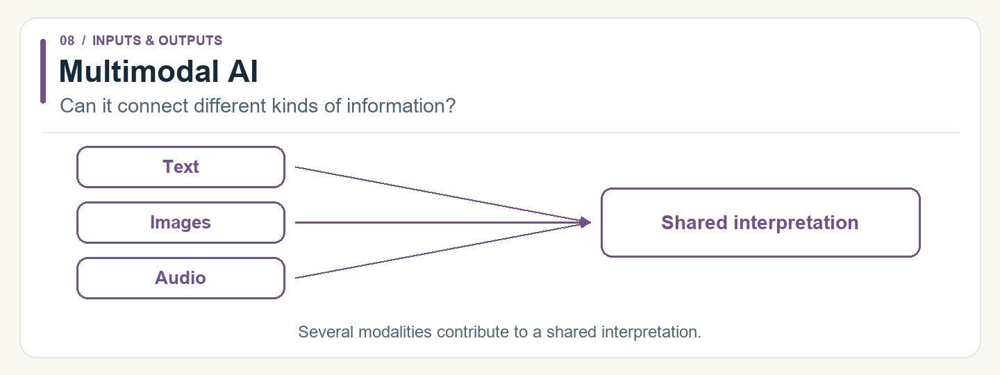

### Generative AI: Can it create content?

**Generative AI produces content based on learned patterns**, including text, images, audio, video, or code. This is the broad capability described in [NIST’s Generative AI Profile](https://nvlpubs.nist.gov/nistpubs/ai/NIST.AI.600-1.pdf).

Our assistant uses this capability when it turns research notes into a draft report. An image generator creating an illustration from a description is another example.

The connection to our earlier terms is useful: the assistant could be multimodal when it interprets charts and text, generative when it drafts the report, and agentic when it chooses searches and follows up on missing evidence.

Those are three different capabilities, even when one product combines them.

**Creating a plan does not mean executing it. Accepting images does not mean generating them.** And a polished report still needs factual checking.

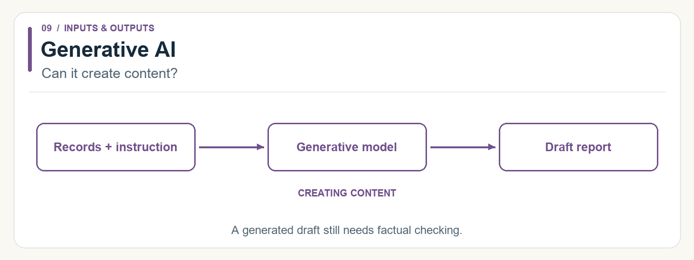

## How does it interact, learn, and reason?

Once a system can interpret information and produce useful outputs, we can ask how it participates in the world around it.

### Embodied AI: Does it perceive and act through a body?

**Embodied AI connects perception and action through a body in an environment**, whether physical or simulated. The system must work with space, movement, and the consequences of its actions.

A warehouse robot picking an object must identify it, move toward it, and adjust its grip based on what happens. [Google DeepMind’s RT-2 research](https://deepmind.google/blog/rt-2-new-model-translates-vision-and-language-into-action/) provides a real example of connecting visual and language information with robotic actions.

An embodied system can also be multimodal and agentic. Our software assistant does not become embodied simply because it searches the web or books appointments. Giving an assistant a robotic body would introduce a different set of capabilities and physical constraints.

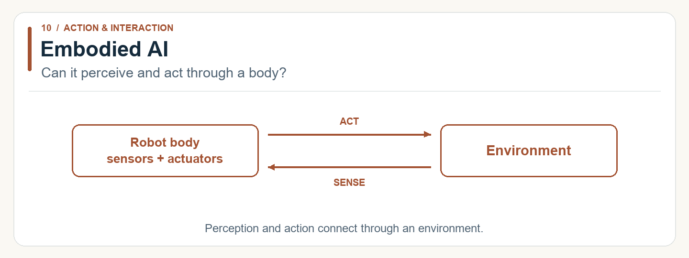

### Adaptive AI: Can it adjust when conditions change?

**Adaptive AI is a broad label for systems that adjust their behavior or models in response to changing conditions.** That might involve feedback, updated context, online learning, or controlled retraining. These mechanisms are different, so the useful follow-up is: what changes, and how?

Our assistant could adjust its responses after feedback that we prefer shorter explanations. A spam filter could be retrained as new kinds of unwanted messages appear. The first might change behavior using context or saved preferences; the second might change the model itself. Adaptation does not always mean learning new model parameters.

Continual learning is one relevant research area. [Parisi and colleagues’ review](https://arxiv.org/abs/1802.07569) explains a central difficulty: learning new information can interfere with previously learned capabilities, a problem known as catastrophic forgetting.

Adaptation therefore needs evaluation. A system that changes is not automatically a system that improves.

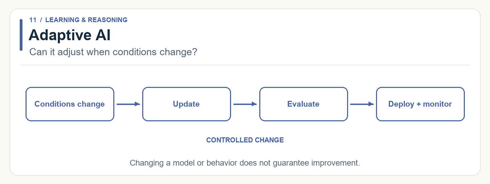

### Neuro-symbolic AI: Can learned patterns work with explicit knowledge?

Neural networks are useful for learning patterns from examples. Symbolic approaches represent explicit knowledge, relationships, or rules.

**Neuro-symbolic AI combines these approaches.** Imagine asking our assistant, “Is every red object in this picture to the left of a blue object?” A neural component could identify the objects, while a symbolic component reasons about their relationships. Recognition supplies information that explicit reasoning can work with.

[IBM Research’s neuro-symbolic work](https://research.ibm.com/topics/neuro-symbolic-ai) explores combining statistical learning with knowledge and reasoning. The depth of integration varies across approaches; adding an ordinary rule check beside a model is only a loose illustration of the idea.

The combination does not automatically make a system correct or explainable. The learned component, the knowledge, and their interaction can all be wrong.

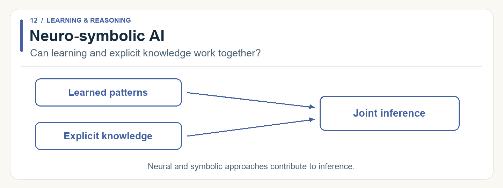

### Collaborative AI: How do people or agents work together?

**Collaborative AI emphasizes cooperation**, often between people and AI, and sometimes among multiple AI agents. The term is broad, so context matters.

When reviewing our assistant’s research brief, we might correct an assumption, ask it to compare alternatives, and decide which conclusions are useful. A designer refining AI-proposed layouts follows a similar pattern. Several AI agents could also divide a research task and exchange findings.

[Amershi and colleagues’ Guidelines for Human-AI Interaction](https://www.microsoft.com/en-us/research/publication/guidelines-for-human-ai-interaction/), published at CHI 2019, offer a research foundation for designing these interactions, including communicating capabilities and supporting correction.

In human-AI collaboration, the person needs the information, time, and controls to influence the result. A nominal approval button alone tells us little about the quality of that collaboration.

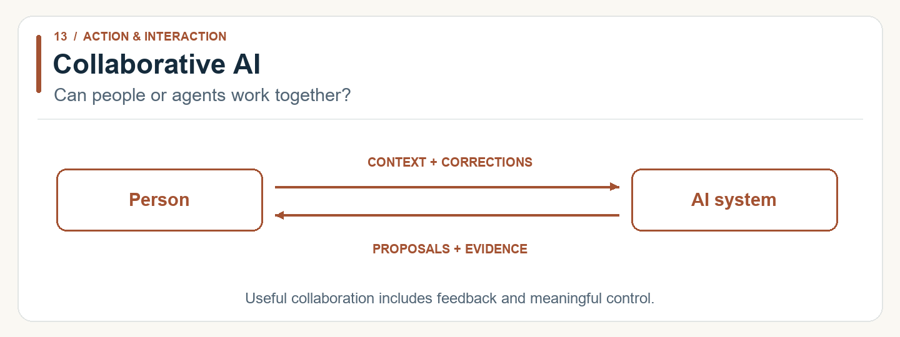

## Can we understand it, rely on it, and govern it?

The final group changes the focus from capability to the conditions under which that capability should be used.

### Explainable AI: Can people understand the basis for an output?

**Explainable AI aims to make a system’s behavior or outputs understandable to people.** What counts as a useful explanation depends on the audience and purpose.

If a quality-inspection system flags a manufactured part, an operator might need to know which features contributed to the result. A developer investigating the same decision might need a more technical account of the model’s behavior.

[NIST’s Four Principles of Explainable AI](https://www.nist.gov/publications/four-principles-explainable-artificial-intelligence) emphasize explanation, meaningfulness, accuracy of the explanation, and knowledge limits.

A fluent explanation is not necessarily a faithful one. A model’s generated story about its decision should not be accepted automatically as a record of how that decision was made.

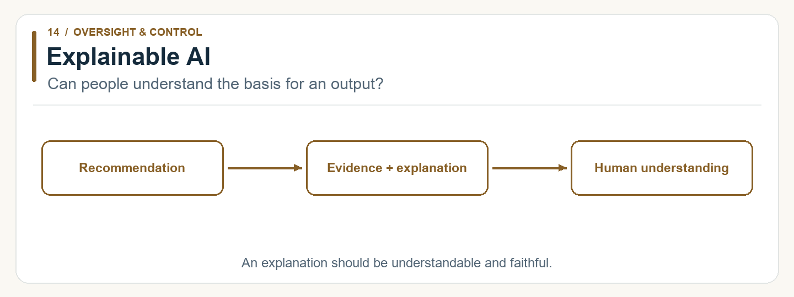

### Trustworthy AI: Is there evidence that we can rely on it?

**Trustworthy AI concerns whether a system deserves reliance in its intended context.** Explainability helps, but it is only one consideration.

[NIST’s AI Risk Management Framework](https://airc.nist.gov/airmf-resources/airmf/3-sec-characteristics/) includes reliability, safety, security, accountability, transparency, explainability, privacy, and fairness among its trustworthiness characteristics. Their importance and trade-offs depend on the use case.

For the speech-recognition part of our assistant, relevant evidence could include accuracy across accents and noisy environments, appropriate handling of recordings, and clear communication when confidence is low. For a robot, safe physical behavior would also be central.

“Trustworthy” should invite the question **“What evidence supports that claim?”** It is not a permanent badge earned by producing one good demonstration.

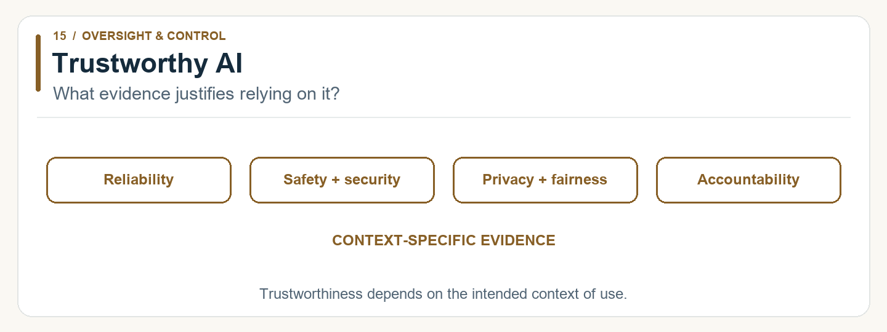

### Responsible AI: Are people managing its development and effects responsibly?

**Responsible AI emphasizes the choices and practices surrounding AI throughout its life:** why it is built, whose needs it serves, how it is evaluated, and who responds when things go wrong.

The [OECD AI Principles](https://www.oecd.org/en/topics/sub-issues/ai-principles.html) connect AI development and use with human rights, fairness, transparency, robustness, and accountability.

For an educational AI tool, responsible practice could include involving teachers and learners, assessing who benefits or struggles, collecting only necessary data, and assigning someone responsibility for complaints and failures.

Responsible and trustworthy AI overlap substantially. A useful emphasis is that trustworthiness asks what justifies reliance, while responsibility asks how people and organizations govern the system and its effects. This is a practical distinction, not a universally fixed separation.

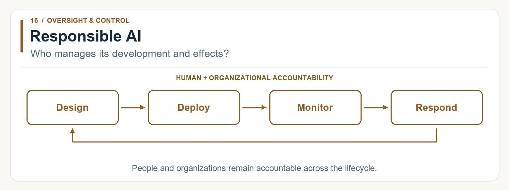

### Sovereign AI: Who controls the capability and its dependencies?

**Sovereign AI concerns meaningful control over AI capabilities**, often at the level of a country or region. Discussions can include data, computing infrastructure, models, skills, and the ability to decide how systems are operated.

Definitions vary. A concrete example is the [Canadian Sovereign AI Compute Strategy](https://ised-isde.canada.ca/site/ised/en/canadian-sovereign-ai-compute-strategy), which links domestic computing capacity with access for Canadian researchers and businesses and protection of data and intellectual property.

If a public institution adopts an assistant like ours, the corresponding questions are practical: Who can access the data? Who can change or withdraw the service? Does the institution have the expertise and rights needed to keep operating or move to another provider?

The implication is that location alone gives an incomplete picture of control. Locally hosted software may still depend on external licenses, updates, or expertise. Sovereignty concerns the wider dependency chain; it does not automatically establish safety or fairness.

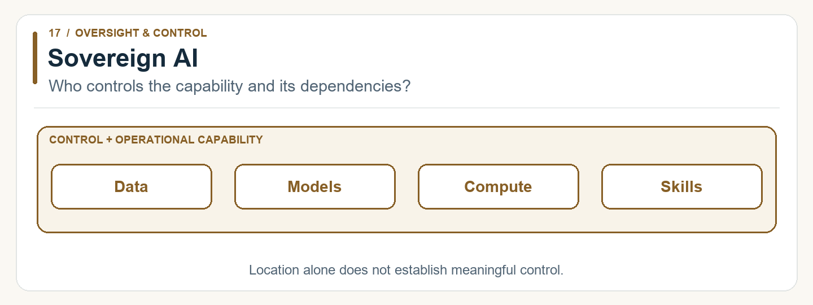

## Put the dimensions together

Think of our digital assistant again. We can describe the same assistant in several ways, depending on the question we ask.

*Start in the middle. Each connected box asks a different question about the same assistant. The four questions at the bottom apply to everything above them. A system may combine several of these ideas; it does not need all 17.*

Suppose you show the assistant a photo and ask it to help solve a problem. Working with the image and your words makes it **multimodal**. Writing an answer uses **generative** AI. Choosing tools, taking actions, and checking the results adds **agentic** behavior.

Now look behind the screen. Separate, replaceable parts make the design **modular**. Handling many more users concerns **scalability**. Running some tasks on your phone is **edge AI**. These labels describe how the assistant is built and operated, even though you experience one product.

If it adjusts after your feedback, it may be **adaptive**. If people guide and refine its work, the interaction is **collaborative**. If a version has a robot body that senses and acts, it is also **embodied**.

The same questions work for a factory robot, a recommendation service, or an educational tool. The combination changes with the task.

**One system can have many descriptions because each description tells us something different.**

Being capable does not settle the questions at the bottom of the picture. We still need to understand its outputs, check whether it deserves our trust, know who handles mistakes, and establish who controls the technology.

Each choice also has a cost. Separate components must work together. More computers need coordination. More freedom to act requires clear limits. Learning from new information requires checking that performance has actually improved.

The appropriate combination depends on the problem. A writing tool may need strong generation and useful human feedback. An inspection device may need reliable local processing. A simple, well-tested prediction model can be more useful for a particular task than an elaborate collection of agents.

The next time a product is described with a string of AI adjectives, translate each one into a question:

**What can it do? How is it built? Where does it run? How does it learn? Who controls it? What evidence shows that it works for the people using it?**

Those questions turn a growing vocabulary into something useful: a way to understand a system, compare choices, and decide what you actually need.
