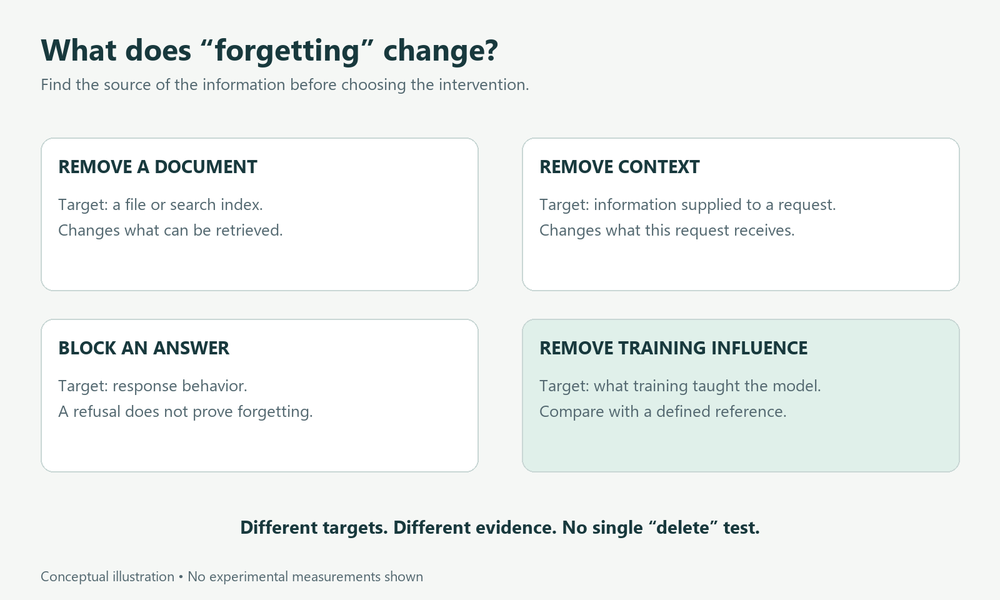

# Can AI Really Forget What It Learned?

*Deleting a file, stopping an answer, and removing the influence of training data are three different tasks.*

Suppose an AI assistant has learned information that its developers later decide should not have been used. They remove the original document. They ask the assistant about it. The assistant refuses to answer.

Has it forgotten?

We still do not know. The document may be gone while its influence remains in the trained model. The refusal may reflect an instruction about what to say rather than a change to what the model can produce under other conditions.

**Machine unlearning** studies how to remove specified training data's influence from a model. In a widely used formulation, the reference is a model trained without those data. The goal is to make the updated model behave sufficiently like that reference, under a defined measure and set of assumptions. A 2026 ICML position paper argues that many claims about “unlearning” in language models blur this objective with other useful but different interventions. That is the authors' argument, not a settled definition for every research community. [Yoon, Jun, and No](https://proceedings.mlr.press/v306/yoon26g.html).

The distinction matters whenever someone promises that a model has forgotten something.

## First, locate the information

Imagine a fictional assistant trained on biographies of invented authors. One biography says that Mira Vale wrote a book called *The Glass Orchard*. We want to remove that biography's influence. Neither the person nor the book is real; this is an illustrative example.

Before changing anything, we need to know how the assistant obtains the answer.

It might read a biography from a searchable document store each time someone asks. It might receive the biography in the current conversation. Or the information might influence the numerical settings learned during training, usually called the model's **weights**.

Those situations call for different interventions. Removing a document from a search index changes what can be retrieved. Clearing a conversation changes the context supplied for that conversation. Neither operation, by itself, modifies the model's trained weights.

An application may use all three sources at once. It may also keep logs or copies elsewhere. A claim about one model cannot automatically describe every place where an application's information exists.

*Different locations require different changes. This is a conceptual map, not a deletion procedure for a particular product.*

## Why there is no simple delete key

A trained language model is not ordinarily a database with one removable row for each fact. Training adjusts many numerical relationships, and a piece of training data can affect behavior in ways that overlap with other examples.

Our invented biography might teach the model a book title. It might also contribute to its familiarity with the form of a biography. Removing the title while preserving useful language behavior is a more specific task than making the whole model worse at answering questions.

The difficult reference question is: how would this model have behaved if the biography had never been included?

Even that requires care. Training involves randomness, so a retrained model need not have exactly the same numerical weights as another retrained model. Unlearning research therefore needs an explicit comparison target rather than an informal claim that the unwanted information is “gone.” [Discussion of retraining-based definitions](https://proceedings.mlr.press/v306/yoon26g.html).

For the reader, the practical consequence is simple: ask what “forgetting” means in the experiment before interpreting the score.

## Retraining is a reference, but it has a cost

One direct approach is to rebuild a model from an appropriate starting point using the retained dataset. For a large system, repeating substantial training can be expensive. That motivates methods intended to approximate the desired result more efficiently.

The SISA approach offers a useful architectural example. It organizes training into separated parts so that removing particular examples requires retraining only affected components, rather than starting the entire process again. Its name expands to Sharded, Isolated, Sliced, and Aggregated training. The important idea is to plan for removal before it becomes necessary. [Bourtoule and colleagues, Machine Unlearning](https://arxiv.org/abs/1912.03817).

In our fictional biography project, this would resemble arranging the learning process so that one biography does not affect every training component. That analogy explains the design intention; it is not a claim that modern language models can always be divided neatly by author.

Other approaches change an already-trained model. These introduce another question: how much unwanted influence was removed, and how much useful capability was lost along the way?

## A refusal is an observation, not a complete test

Ask the assistant, “What did Mira Vale write?” Suppose it responds, “I cannot help with that.”

That shows how it answered one question. It does not tell us what would happen with a different wording, a partial quotation, or a request to complete a sentence. It also does not establish whether the information influenced some other output.

This is where careful benchmarks help. TOFU, the Task of Fictitious Unlearning, constructs an evaluation around invented author profiles. Researchers can specify what should be forgotten and compare with a reference model that was not trained on those profiles. The benchmark also examines retained usefulness, because forgetting everything would be an unhelpful solution. [TOFU project](https://locuslab.github.io/tofu/).

That controlled setup is valuable precisely because real training histories are often harder to disentangle. It is still a benchmark with particular data, models, and tests. Passing it does not establish success for every type of sensitive information or every future query.

## Forgetting should survive relevant changes

Suppose the assistant passes today's questions. Its developers then compress the model to deploy it more cheaply. Does the result still hold?

Research titled *Catastrophic Failure of LLM Unlearning via Quantization* investigates this issue. Quantization stores model numbers at reduced precision. In the tested settings, this transformation could make supposedly forgotten information accessible again after certain unlearning methods. The result challenges the durability of those methods; it does not show that every unlearning approach fails after every compression procedure. [Zhang and colleagues](https://arxiv.org/abs/2410.16454).

The broader lesson is methodological. If a model will be compressed, adapted, or queried in particular ways after unlearning, its evaluation should account for that intended use. A successful test on an intermediate version is not automatically a successful test on the deployed version.

For the fictional assistant, we would want to test the model that readers actually encounter, not merely the version before deployment changes.

## What would convincing evidence look like?

A useful report would tell us which records were targeted, how the reference model was defined, what queries or attacks were tried, and what useful abilities remained.

It would also explain the scope of its claim. Removing the influence of one biography is not identical to making every fact in it impossible to infer. Another retained source might contain the same book title. Conversely, failure to produce the title under a handful of questions is not proof that the biography's influence was removed.

These differences make a single “forgetting percentage” difficult to interpret on its own. We need the target, the comparison, the test, and the limits.

For someone evaluating an AI product, a productive question is: **what changed, and what evidence shows that it changed?**

If the answer is “we removed a document,” that describes a storage intervention. If it is “the assistant now refuses,” that describes observed response behavior. If it is “we evaluated removal of training influence against a retraining reference,” we are closer to a substantive machine-unlearning claim.

All of these actions can have a purpose. Clear language helps us judge the purpose each one actually serves.

*Evidence checked 8 October 2026. The running example is fictional. This article explains technical research, not a legal standard for data deletion. The source notes distinguish a position paper, benchmark, and empirical studies.*
