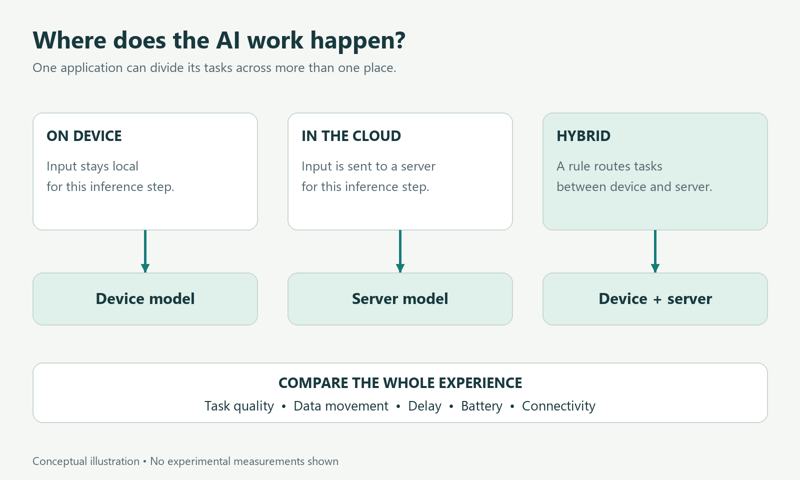

# Does AI Need the Cloud?

*What can run on your own device, and why the best answer depends on the task.*

You record a voice note on your phone. An assistant turns it into text, pulls out three reminders, and offers to check tomorrow's train timetable.

It feels like one interaction. Underneath, it could involve several models, ordinary software, and a mixture of local and remote processing.

That is the starting point for understanding **on-device AI**: the model performs its computation on the user's device. With **cloud AI**, that computation happens on remote servers. A **hybrid** application combines the two. These descriptions concern where work happens; they do not, by themselves, tell us how intelligent, private, fast, or reliable the application is.

The distinction is becoming more practical. Google's LiteRT-LM provides infrastructure for running language models across devices, and Apple's June 2026 foundation-model announcement includes both on-device and server models. These are documented implementation choices, not proof that one arrangement is best for every user. [Google AI Edge](https://developers.google.com/edge/litert-lm), [Apple's announcement](https://machinelearning.apple.com/research/introducing-third-generation-of-apple-foundation-models).

## Running a model is different from training it

Training adjusts a model's numerical settings using data. **Inference** is the computation performed when the trained model processes a new input.

An on-device feature usually refers to local inference. It does not mean the model was originally trained on that phone. Apple, for example, describes large-scale training followed by optimization for different deployment hardware. [Apple's training overview](https://machinelearning.apple.com/research/introducing-third-generation-of-apple-foundation-models).

Our voice-note example is hypothetical. The transcription model could have been trained elsewhere and downloaded to the phone. The phone would then use it to process a recording without uploading that recording for inference.

This also explains why “works offline” needs a little precision. A feature might work without a connection after its model is installed, while still needing a connection for initial downloads, updates, or external information. A request to check tomorrow's timetable needs an appropriate source of timetable data, wherever the language model runs.

*A conceptual comparison. A hybrid application needs a clear rule for which information crosses the device boundary.*

## What local processing can change

Keeping inference on the device can remove a network round trip and reduce the need to send raw inputs to a server for that step. It can also make a feature usable when connectivity is poor, if the necessary models and data are already available.

For the voice note, those benefits are concrete. A local transcription feature could produce text during a train journey through an area with unreliable reception. A local reminder extractor could work from that transcript without waiting for a server.

But the entire application matters. Imagine that it later synchronizes recordings to an online account. Local transcription would still be local transcription; the application would not therefore keep every recording permanently on the phone.

The relevant privacy question is about data flow: what leaves, why, where it is stored, and who can access it? The location of one model answers only part of that question. This is an architectural distinction, not an assessment of a particular product's privacy practices.

## The device has a budget

A phone shares its memory, processing power, and battery with everything else its owner is doing. A model that fits into storage may still need substantial working memory while running. Long inputs and ongoing conversations can add demands beyond storing the model itself.

Researchers and engineers address these constraints in several ways. One is **quantization**, which represents model numbers with fewer bits. Another is changing the model architecture so that inference requires less work or data movement. Apple's 2025 technical report describes both an on-device model and a server model, including low-bit optimization for the local model. These are the company's reported designs and evaluations. [Apple's 2025 technical report, available on arXiv](https://arxiv.org/abs/2507.13575).

There is a useful intuition here: a smaller computational footprint creates room for deployment, but it does not guarantee good results for the intended task. Efficiency and task quality need to be measured together.

Suppose our reminder extractor works well on a short, quiet recording. That does not establish how it performs on an hour-long discussion, an unfamiliar accent, or several people speaking over one another. Nor does one fast response establish acceptable battery use over an afternoon of repeated requests.

## Sometimes the best improvement is a smaller job

An April 2026 preprint by William Oliveira describes integrating small language models into an Android word game. The design moved from asking the model to generate complete structured puzzles toward using curated word lists and asking it for a narrower contribution: short hints. The report documents problems including formatting, constraints, context behavior, and latency. [Less Is More](https://arxiv.org/abs/2604.24636).

This is a practitioner case study, not a controlled comparison covering all mobile applications. Its value is a concrete engineering lesson: deciding what the model should do can matter as much as selecting a model.

Apply that lesson to our imaginary assistant. It need not ask a language model to handle every part of a reminder. The model might identify a proposed task, while ordinary software checks that the date is valid and the user confirms the final entry.

This division also makes errors easier to understand. If the transcription is wrong, improve or review that step. If the task was extracted correctly but the date was interpreted incorrectly, test the date-handling step. A single label such as “local AI” would conceal these differences.

## What the cloud still offers

Remote infrastructure can support workloads that exceed a particular device's resources. It can also make a shared model easier to update centrally. Those benefits come with a different set of dependencies, including the connection and the remote service.

Apple's 2026 model family explicitly spans local and server configurations. Google's LiteRT-LM documentation, meanwhile, shows that local deployment itself spans multiple platforms and hardware options. Together, they illustrate why “device or cloud?” is often a question about arranging capabilities across a system. [Apple's model family](https://machinelearning.apple.com/research/introducing-third-generation-of-apple-foundation-models), [LiteRT-LM documentation](https://developers.google.com/edge/litert-lm).

For our voice-note application, a hybrid design might process short notes locally and offer a remote option for a more demanding task. Another design could keep all inference local and decline requests it cannot handle adequately.

Neither choice is universally correct. The decision depends on what the feature promises, which devices it supports, and what users consider acceptable. A silent switch from local processing to uploading private material would also change the product's meaning for its user, even if the answer became better.

## Test the experience you actually need

Before comparing model sizes or promotional benchmarks, define success in the user's terms.

For the note-taking assistant, that might mean an accurate transcript, correctly extracted reminders, a response within a tolerable time, and clear control over synchronization. These are proposed evaluation criteria for the example, not reported product results.

A useful comparison would use representative recordings on the devices people actually own. It would include repeated use, loss of connectivity, and difficult inputs. It would also record when the application uses a remote service, because an offline demonstration and a connected demonstration may exercise different paths.

The final choice might be modest: a small local feature that does one valuable job consistently. Or it might be a hybrid system that gives the user a clear reason to send selected work elsewhere.

AI does not always need the cloud. What it needs is a deployment arrangement that matches the task, the hardware, and the user's expectations. Asking where the computation happens is a good beginning. Following the whole task tells us much more.

*Evidence checked 8 October 2026. The voice-note application is hypothetical. Provider reports describe their own systems; the mobile-game study is a preprint case study. No devices were benchmarked for this article.*
