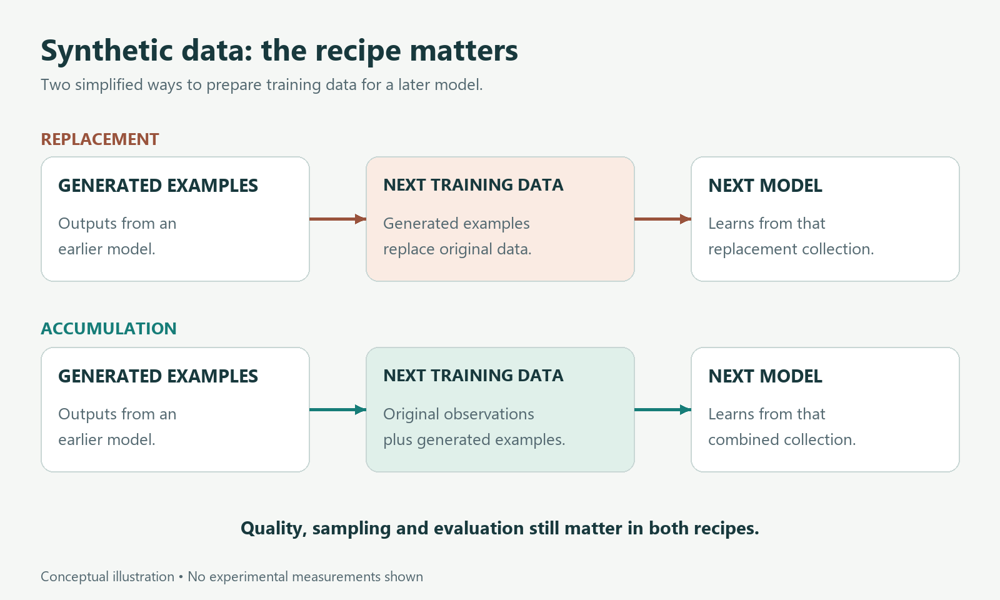

# What Happens When AI Learns from AI-Generated Data?

*Why synthetic data can be useful, why recursive training can go wrong, and why the recipe matters.*

Imagine a small archive of descriptions of birds. Most entries describe common species, but a few record unusual birds, uncommon behaviors, and observations made in difficult conditions.

A language model learns from the archive and produces a new collection of descriptions. We then train another model using that generated collection. Repeat the process.

What survives? What becomes more common? What disappears?

This hypothetical example captures a real research question: what happens when models repeatedly learn from outputs of earlier models?

The answer is more interesting than “AI-generated data is bad.” **Synthetic data** is data produced artificially rather than collected directly in the form being studied. It can come from a simulator, a rule-based process, or a generative model. This article focuses on model-generated training examples. Their effect depends on what they contain, how they are checked, and what role they play in training.

## Why use generated examples at all?

A developer may want more examples of a particular task, a more consistent instructional format, or variations that are difficult to collect in sufficient quantity. A capable model can help produce them.

The 2023 *Textbooks Are All You Need* technical report describes training the phi-1 code model with selected web material and generated educational text and exercises. It is an example of deliberately constructed synthetic data being part of a successful reported training recipe. It does not establish that arbitrary generated material improves any model. [Gunasekar and colleagues, arXiv report](https://arxiv.org/abs/2306.11644).

In our bird archive, a teacher might use a model to turn verified observations into practice questions. The teacher would still need to check the answers. The useful contribution would be creating a learning format from known material, rather than treating every generated statement as a new observation of nature.

That difference will matter throughout the article: generating a useful example and obtaining new evidence about the world are different activities.

## What researchers mean by model collapse

**Model collapse** describes degradation that can arise through repeated model-data feedback loops, where later models learn from earlier models' outputs and progressively lose aspects of the original data distribution. A distribution is simply the pattern of what occurs and how often.

In a Nature paper published in July 2024, Ilia Shumailov and colleagues studied recursive training in mathematical settings and experiments. Their results show how information can be lost across generations, including less common parts of the distribution. The paper demonstrates a failure mechanism under particular conditions; it does not prove that all uses of synthetic data inevitably collapse. [The Nature study](https://www.nature.com/articles/s41586-024-07566-y).

Consider a simplified version of our bird archive. Suppose uncommon observations are already scarce, and a generator does not reproduce some of them in the next collection. A later model trained only on that collection cannot directly learn from the observations that are no longer there.

This illustration is not a simulation or a prediction about any real model. It shows why the fate of rare material deserves attention even when the generated writing remains fluent.

*Different training recipes ask different scientific questions. Keeping original data helped in studied settings; it is not a universal guarantee.*

## Replacement and accumulation are different experiments

The phrase “trained on synthetic data” leaves out an essential detail: what happened to the original data?

Gerstgrasser and colleagues examined this in *Is Model Collapse Inevitable?* Their study compared replacing older datasets with accumulating generated data alongside the original real data. They reported avoiding collapse with accumulation in the settings they investigated, including language-model experiments. Their mathematical analysis gives a bounded-error result within a simplified linear-model framework. [The paper's arXiv version](https://arxiv.org/abs/2404.01413).

Those qualifications are part of the finding. A result for tested recipes and a mathematical result under specified assumptions do not amount to a guarantee for every internet-scale training pipeline.

For our imaginary archive, the contrast is easy to see. One approach throws away the observations and keeps the latest generated descriptions. Another keeps the observations available and adds generated material. Both involve synthetic data, but the second retains a direct connection to the original evidence.

There is also a practical follow-up: how often does the training process actually use the original observations? A file can remain in an archive while contributing little to the examples sampled for learning. “We kept the data” is a beginning, not a complete account of the recipe.

## The training objective matters too

Recent work explores interventions beyond simply deciding whether to retain data.

ForTIFAI, published in *npj Artificial Intelligence* in July 2026, investigates modifying the training loss, the numerical objective used to update a model, to reduce harmful effects in recursive training. Its confidence-aware approach changes how contributions from highly confident predictions are weighted. The authors report mitigation in their evaluated language-model settings. [Shabgahi and colleagues](https://www.nature.com/articles/s44387-026-00127-w).

This is evidence for a proposed technique in the study's setup, not a general solution for all model sizes, tasks, or mixtures of data. Its importance for a general reader is the extra dimension it reveals: the outcome depends on how the model learns from examples, as well as which examples it receives.

Imagine two students with the same pile of exercises. If their feedback emphasizes different mistakes, the learning process can differ. That is only an analogy; a model's loss function is a mathematical rule, not a teacher's judgment. But it helps explain why counting synthetic examples alone is incomplete.

## Fluent repetition can hide missing coverage

Return to the bird descriptions. A collection might look excellent if a reviewer reads only a few common examples. That review could miss whether rare species or unusual conditions have disappeared.

This suggests two separate evaluation questions. Are individual examples correct? And does the collection cover what the intended task requires?

A generated description can be correct yet add little variety. A diverse collection can contain factual errors. A training pipeline needs to consider both, rather than treating fluency as a proxy for either one.

There is a third question: does the resulting model perform better on appropriate material that was kept separate from training? Generating more practice examples is useful only if learning from them improves the capability we care about. An evaluation that accidentally includes familiar training answers would make that judgment harder.

These are suggested evaluation principles for the archive example. They are not a claim that any one cited experiment has solved every issue of correctness, diversity, or contamination.

## What to ask about a synthetic-data claim

Before accepting either a promise or a warning, ask what process is being described.

- What generated the examples, and what information did it start from?
- Were outputs checked, filtered, corrected, or simply accepted?
- Were original observations retained, and how were they sampled?
- Was this one training stage or a repeated feedback loop?
- Were both common and uncommon cases included in evaluation?

These questions explain why two papers can reach different results without necessarily contradicting one another. They may be studying different mixtures, feedback loops, objectives, or tests.

They also prevent a misleading jump from a laboratory experiment to a sweeping forecast about every future model. Controlled experiments help identify mechanisms. Predicting an entire technology ecosystem requires additional evidence about how systems are actually built and used.

## Keep the connection to reality visible

Synthetic data can reorganize knowledge, expand practice material, and support learning. It can also repeat errors or narrow the information available to later models. The label alone does not tell us which outcome to expect.

For our bird archive, the essential question is whether generated material helps a learner make better sense of observations, or gradually replaces those observations with an increasingly incomplete account.

For AI more broadly, the same distinction offers a useful standard: examine the source of the examples, the training process, and the independent evidence of improvement. More generated text is easy to count. Better learning is what needs to be demonstrated.

*Evidence checked 8 October 2026. The archive is hypothetical. The Nature paper's March 2025 author correction, concerning notation in its theoretical setup, is recorded in the source notes. No training experiment was independently reproduced for this article.*
